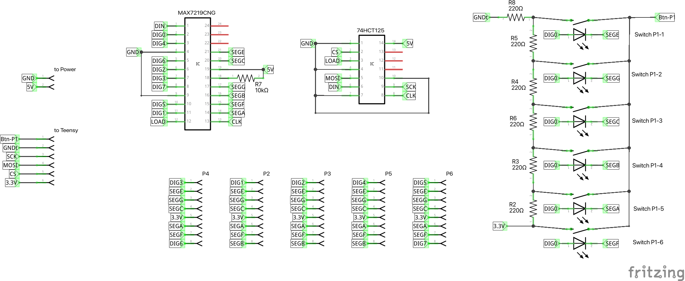
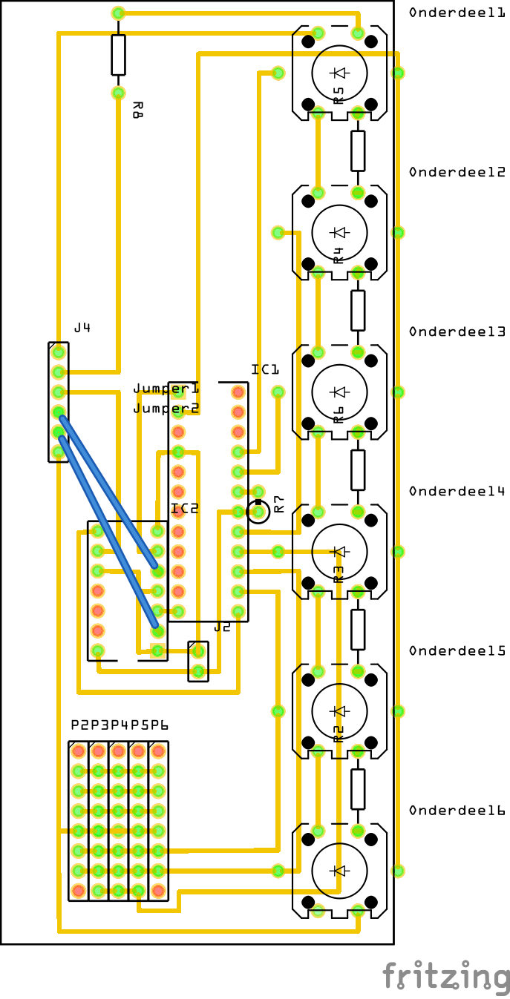
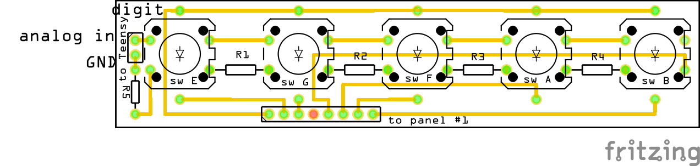

# LED Panels

LED Panel #1 contains the blue LEDs, and the MAX7219CNG and the 74HCT125 ICs.

From panel #1 the connections are made to the other panels (#2 to #6), as depicted in the schema:

We use female-female jumper cables to connect all panels together. 8-pin cables to connect all panels and a 6-pin cable to connect the panel #1 PCB to the Teensy PCB.

## PCBs

PCB panels may not be correct: placement of diodes should be common cathode! At this moment, they are common anode :-). But the switch is bidirectional, so you can just rotate the switches.

### Panel #1

Some jumper cables are not placed to not cloud the pcb, the dotted lines mark which jumper cables should be placed.

### Panel #2

## BOM

For panel #1:

- 1x PCB 12x5 (cut from a 15x9 PCB)
- 1x MAC7219CNG
- 1x 74HCT125
- 1x 24-pin IC socket
- 1x 14-pin IC socket
- 1x JCT power cable
- 1x male header 6 pins (to teensy)
- 1x female-female jumper cable 6 pins (to teensy)
- 5x male header 8 pins (to all other panels)
- 5x female-female jumpber cable 8 pins (to all other panels)
- 6x blue tactle LED button

For panel #2:

- 1x PCB 10x2.2
- 1x male header 8 pins (from panel #1)
- 5x red tactle LED button
- 1x male header 2 pins (to teensy)

For panel #3:

- 1x PCB
- 1x male header 8 pins (from panel #1)
- 6x green tactle LED button
- 1x male header 2 pins (to teensy)

For panel #4:

- 1x PCB
- 1x male header 8 pins (from panel #1)
- 9x orange tactle LED button
- 1x male header 2 pins (to teensy)

For panel #5:

- 1x PCB
- 1x male header 8 pins (from panel #1)
- 6x orange tactle LED button
- 1x male header 2 pins (to teensy)

For panel #6:

- 1x PCB
- 1x male header 8 pins (from panel #1)
- 9x green tactle LED button
- 1x male header 2 pins (to teensy)
