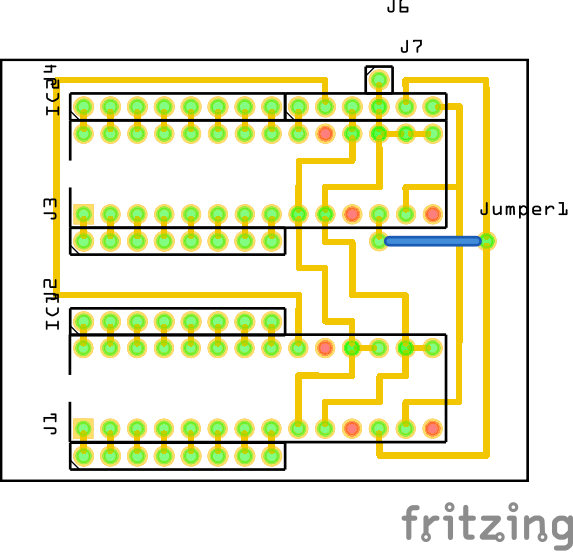

# MCP23017

We have two MCP23017 to interface with all encoders. These chips are placed on a separate PCB that is fixed to the frontpanel. We have exactly one spot that fits :-). The PCB is a 5x7 PCB that is cut to 5x4 size, so we need to drill two extra holes.

## BOM
- 1x 5x7 PCB
- 2x MCP23017
- 2x 28pin IC socket
- 4x female header 8pins (using male jumper cable to all encoders)
- 1x male header 6pins (to Teensy PCB)
- 1x female-female jumper cable 6pins (to Teensy PCB)
- 1x male or female 1pin (for ground to all encoders)
