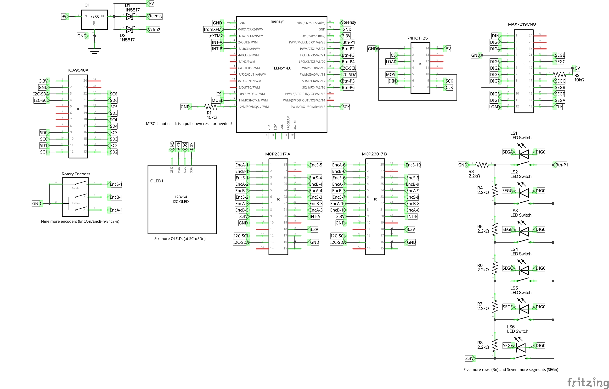

# fm-synth
An FM synth based on XFM2 (sounds) and Teensy (operation)

Goal of this project:
- Use an XFM2 for sound creation
- Interact via serial communication between the XFM2 and a teensy (4.0)
- Use the Teensy to drive seven OLED displays for displaying all information about the synthesizer
- Use the Teensy to monitor 9 rotary encoders (that also include a push button)
- Use the Teensy to drive a lot of LED's (42 in total)
- Use the Teensy to monitor a lot of push buttons (also 42)

We use a lot of multiplexer to get this done:
- A TCA9548A to multiplex the different OLED displays (all displays use 3C as I2C address...)
- A MAX7219CNG to drive a max total of 42 LED's
- A 74HCT125 to levelshift between the Teensy and the LED driver
- Two MCP23017 to monitor the rotary encoders (2 ports for the encoder, 1 port for the button). These MCP23017 will create an interupt after which you can read the level of a particular encoder

The diagram below depicts all components. Power is supplied by a regulator, delivering 5V to the LED driver and 4.7V to the Teensy and XFM2. This way, the USB can still be used to power the Teensy OR the XFM2 if we need to maintain the program on one of these MCU's. Normally, we don't use the USB ports...

