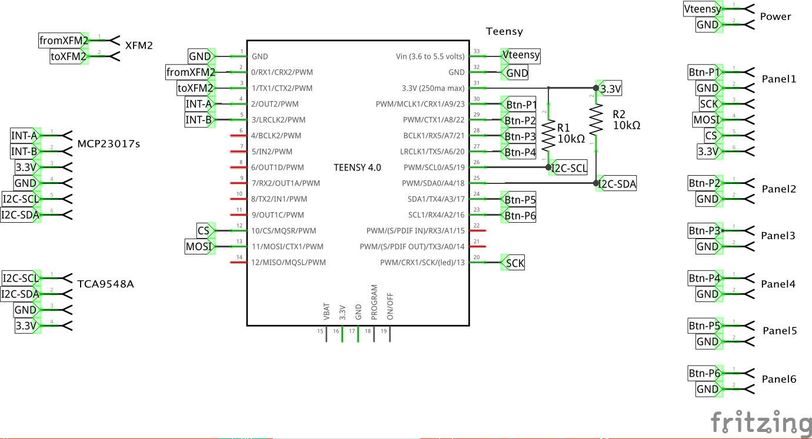
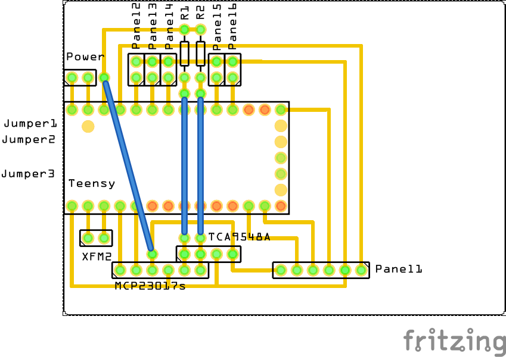

# fm-synth
An FM synth based on XFM2 (sounds) and Teensy (operation)

Goal of this project:
- Use an XFM2 for sound creation
- Interact via serial communication between the XFM2 and a teensy (4.0)
- Use the Teensy to drive seven OLED displays for displaying all information about the synthesizer
- Use the Teensy to monitor 9 rotary encoders (that also include a push button)
- Use the Teensy to drive a lot of LED's (42 in total)
- Use the Teensy to monitor a lot of push buttons (also 42)

We use a lot of multiplexer to get this done:
- A TCA9548A to multiplex the different OLED displays (all displays use 3C as I2C address...)
- A MAX7219CNG to drive a max total of 42 LED's
- A 74HCT125 to levelshift between the Teensy and the LED driver
- Two MCP23017 to monitor the rotary encoders (2 ports for the encoder, 1 port for the button). These MCP23017 will create an interupt after which you can read the level of a particular encoder

## Individual parts

- [Power PCB](power-source.md)
- [Teensy PCB](teensy-pcb.md)
- [TCA9548A and OLEDs](TCA9548A-OLEDs.md)
- [MCP23017s](MCP23017s.md)
- [LED Panels](LED-panel.md)

## Overview

The diagram below depicts all components. Power is supplied by a regulator, delivering 5V to the LED driver and 4.7V to the Teensy and XFM2. This way, the USB can still be used to power the Teensy OR the XFM2 if we need to maintain the program on one of these MCU's. Normally, we don't use the USB ports...

The main IC's are distributed over three separate PCB's:
- Power
- Teensy
- XFM2

The TCA9548A is directly fixed to front panel, as are the zeven OLED screens. The screens, TCA9548A and Teensy are connected using a special-made jumper cable, displayed below:

The MAX7219CNG and 74HCT125 IC's are placed on panel 1, with six LED toggle switches. The other panels (2,3,4,5) are connected to this pain panel via a 8-pin jumper cable. From panel 1 a 6-pin jumper cable runs back to the Teensy. The other panels have a 2-pin connection back to the teensy.

The MCP23017 IC's are places on a separate PCB. A 6-pin jumper cable runs back to the Teensy. The rotary encoders are connected directly to the MCP23017s, using in total 31 jumper cables (3 per rotary encoder, 10 encoders in total, plus ground).

The picture below depicts the schema for the Teensy PCB, showing all connections to the other boards.

The Teensy itself is placed on a 5x7 PCB:

