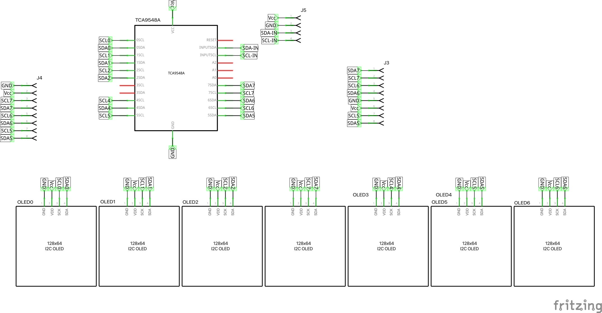
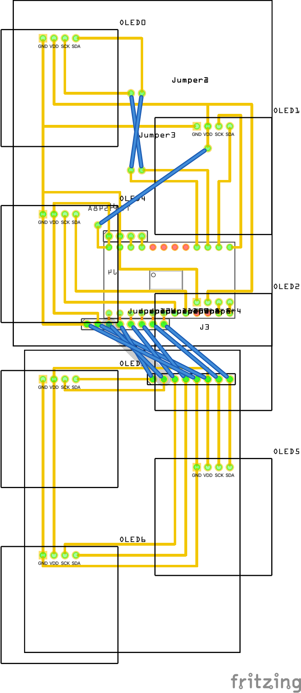

# OLEDs and TCA9548A multiplexer

De OLEDs worden via een TCA9548A multiplexer verbonden met de Teensy. Reden is dat alle OLEDs op hetzelfde I2C adres zitten, dus een enkele bus gaat niet werken.

De TCA9548A heeft 8 afzonderlijke I2C bussen, dus je kunt maximaal 8 OLEDs aansturen.

Onderstaand figuur geeft het schema voor de verbindingen.

Het idee is om alle OLEDs direct op het frontpanel te bevestigen. Vervolgens hebben we twee PCBs (5x7 en 6x8) die female headers hebben waarop de OLEDs aangesloten kunnen worden. Op die manier "klik" je eigenlijk de PCB's op de OLEDs. De twee PCB's worden verbonden met een custom 8x8 female header kabel. Op de grootste PCB zit ook de TCA9548A multiplexer (op de andere kant dan de female headers). Aan deze kant zit ook weer een male header (4 pins), waarmee de TCA9548A verbonden is met de Teensy.

Unsure: do we need pull-up resistors for the I2C lines? Not a problem to add to the board, but unsure...

Minimum dimensions for the board:
- PCB 5x7 cm: 18x17
- PCB 6x8 cm: 18x27

The OLED screens are fixed to the front panel, the PCB board are attached to the OLED screens via the female headers, this means that we don't have to use the screw holes of the PCBs.

## BOM

- 1 TCA9548A
- 7 OLEDs
- 1 PCB 5x7
- 1 PCB 6x8
- 7 female headers 4 pins
- 1 male header 4 pins
- 2 male headers 8 pins
- 1 custom female wire 8 pins
