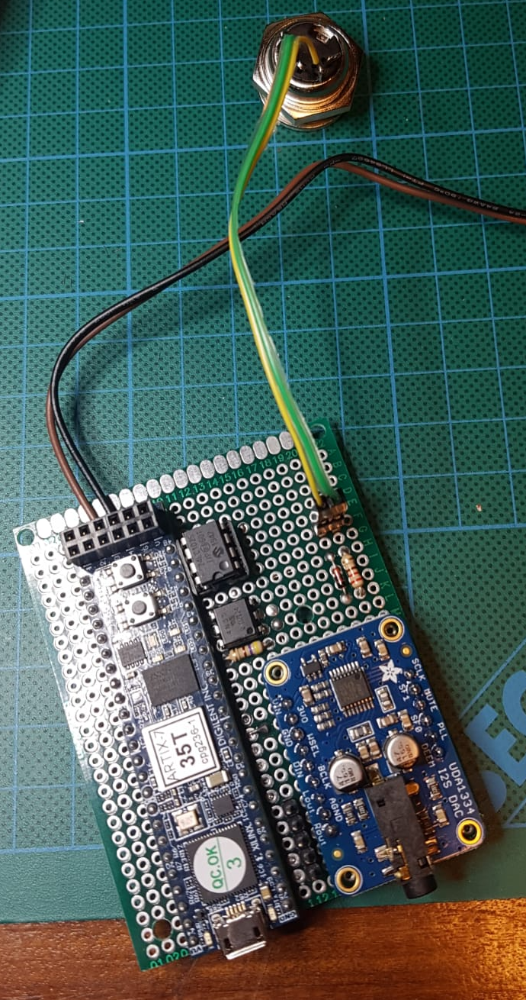

# XFM2 board

Het XFM2 board bestaat uit de CMOD-A7-35T breadboard friendly bordje, plus de UDA1334a I2C stereo DAC bordje. Deze wordt aangesloten conform de beschrijving op https://www.futur3soundz.com. Anders dan op die beschrijving, doen we ook nog:

1. Een externe power input mogelijkheid (directe kabeltjes)
2. Stereo audio-out vanaf de DAC naar een dual jack output
3. Een RX/TX serial port mogelijkheid voor verbinding van de Teensy met de XFM2
4. De MIDI-in zit niet op de PBC, maar hiervoor wordt ook een afzonderlijke kabel gemaakt.

Het schema ziet er als volgt uit:

## PCB

De PCB ziet er als volgt uit. We gebruiken:

- PCB 60x80 mm
- Minimale aantal pins: 19x24

Omdat het PCB aan de bovenkant direct moet beginnen met holes, omdat we zowel de mini-USB als mini-jack willen kunnen gebruiken, moeten we het PCB afsnijden. Hierdoor zijn de verbindingsgaten aan de voorkant niet bruikbaar. De oplossing is om extra gaten te boren:

- Rechtsboven
- Linksmidden (linksvoor kan niet, daar is geen ruimte genoeg)
- Links en rechtsonder

Het PCB kan in principe aan de onderkant ook een stukje korter gemaakt worden, of we gebruiken de gaten die daar al zitten.

Merk op dat de "to Power" header feitelijk gewoon de draden zijn naar de powerconnector.

## BOM

- 1x PCB 6x8
- CMOD A7 35T
- UDA1334a
- 24LC1025 memory
- 8 pins IC voetje
- 4N35 optocoupler
- 1N4148 diode
- 220 Ohm resistor
- 470 Ohm resistor
- 1x 5-pin male header (2 pins to Teensy, 3 pins for audio out)
- 1x 2-pin male header (for midi-in)
- 1x JST power cable

## Installatie
De installatie volgens de website van de XFM2 gaat vrij straight-forward. Wel handig om in Realterm de display op uint8 te zetten, dan krijg je nummertjes terug in plaats van letters. In mijn geval was de com-poort nummer 6 (dat is te zien in Realterm), dus COM6 bij installatie met XLoad.

## Resultaat
Onderstaande afbeelding geeft het resultaat. Merk op dat de MIDI poort via een jumper-kabeltje is aangesloten, op de volgende manier:

- GROEN (4, vcc pin) gaat naar de weerstand
- GEEL (5, data-pin) gaat naar de diode

