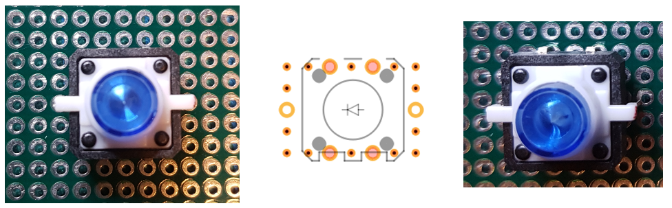

# Front panel

The front panel is made up of the following elements:

- Panels #1 to #6, fitting tightly together. Will probably fit them using screws, need to find out...
- A panel containing the MCP23017s, fitted to the front panel via two screws
- The OLED screens and PCBs, fitted to the front panel via four screws for every OLED screens. The PCBs are attached to the OLED screens via the headers, so no screws needed.
- The 10 rotary encoders, using the nuts and screw wire of the encoder itself.

Not all encoders are displayed: some are obscured by the PCB's (which need to be cut into shape!)

The buttons are placed at the right spot, but because the pins are not actually on the correct place, the allignment isn't correct.

## Dimensions

As most elements are attached to PCB screens, the dimensions of the front panel is best measured in "dots" of 0.1x0.1 inch, or 2.54x2.54 mm.

Most important are the dimensions of the tactle LED button, as depicted below:

The placement of the pins is not quite breadboard friendly, but it is just possible to place the pins according to the figure below. This means bending in the switch pins a bit inside. Be careful: the LED pins are quite fragile!

Doing it this way, the button itself is exactly in the middle of a 7x7 dot rectangle. This means that if you rotate the button, the centre of the button doesn't move.

The distance between two buttons is 8 dots, so exactly 20.32 mm

The dimensions of the OLED screen are 10x10 dots, overlapping the dot area a bit, so you need 7 dots between two leds and 4 dots on each side of the leds. The holes for the screws are in the corners of the 10x10 matrix, so 9x2,54 = 22,86 mm apart.
