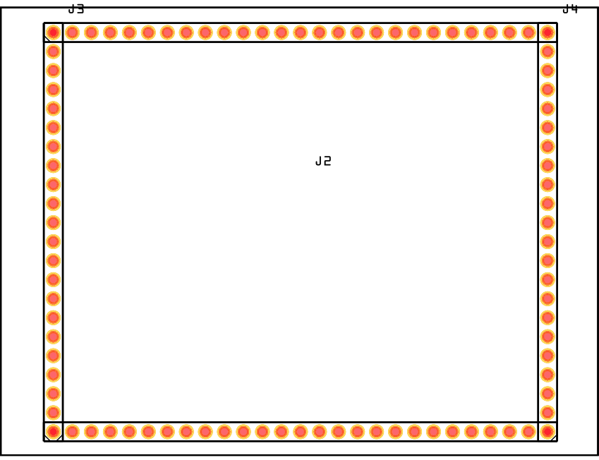
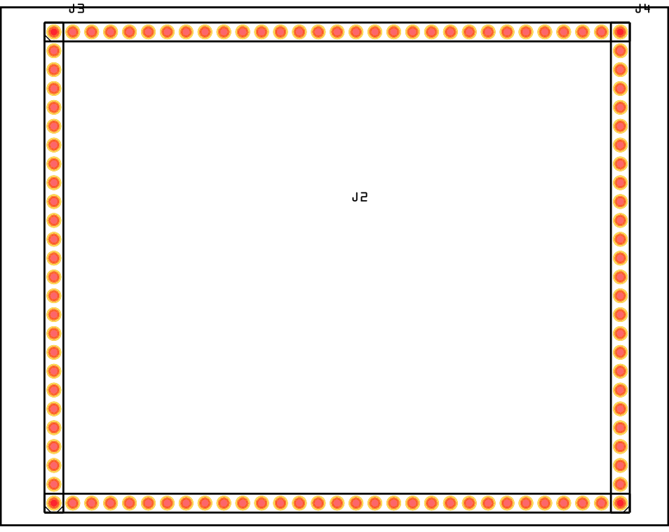
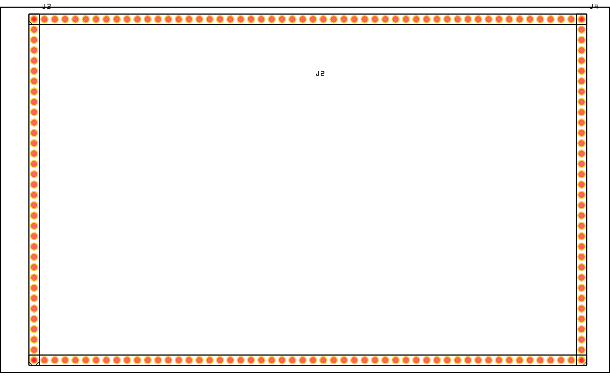

# Protoboards

## 50 x 70 mm

Aantal holes: 18 x 24

Aanwezig: 8

## 60 x 80 mm

Aantal holes: 22 x 27

Aanwezig: 2

## 70 x 90 mm

Aantal holes: 26 x 31

Aanwezig: 2

## 90 x 150 mm

Aantal holes: 34 x 54

Aanwezig: 4

