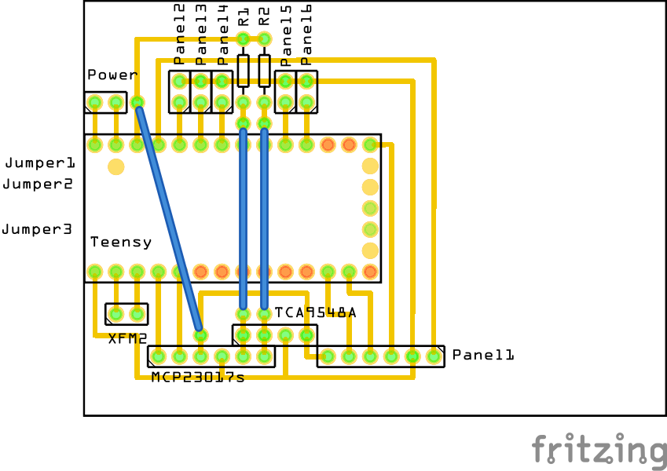

# Teensy PCBs

The Teensy PCB only holds the Teensy, plus a lot of connectors. We may put the Teensy PCB and the Power PCB on the same PCB?

The schema is as follows:

We use (again...) a 5x7 PCB to hold the Teensy:

We need to cut the PCB very tightly, because we need ground and 5V to be connnected, BUT also directly outside the PCB, because we want to be able to use the mini USB! This also means that we have to drill some extra holes to fix the Teensy PCB to the enclosure.

Minimal pins on the PCB: 17x17

## BOM

- 1x 5x7 PCB
- 1x Teensy 4.0
- 1x Power JST cable
- 2x male headers 6pins
- 1x male header 4pins
- 5x male headers 2 pins (or 2x 2x3 pins female - if we use male jumper cable)
- 5x female-female 2 pins jumper cable (or male/male??) => need to make, or use individuals...
- 1x male header 2pins
