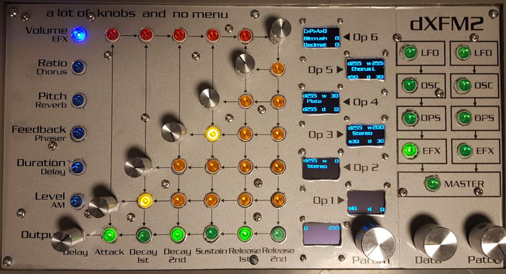

# EFX Effects menu

| Blue | 6 (Out) | 0 (Op1) | 1 (Op2) | 2 (Op3) | 3 (Op4) | 4 (Op5) | 5 (Op6) |
|------|---------|---------|---------|---------|---------|---------|---------|
| 0 |  |  | *Bitcrusher* Depth | *Decimator* Depth | *Filter* Hi pass | *Filter* Lo pass | EFX Routing |
| 1 | *Chorus* Dry | *Chorus* LR Phase | *Chorus* Speed | *Chorus* Feedback | *Chorus* Depth | *Chorus* Mode | *Chorus* Wet |
| 2 | *Reverb* Dry | | *Reverb* Decay |  | *Reverb* Damp | *Reverb* Mode | *Reverb* Wet |
| 3 | *Phaser* Dry | *Phaser* LR Phase/Offset | *Phaser* Speed | *Phaser* Feedback | *Phaser* Depth | *Phaser* Mode/Stages | *Phaser* Wet |
| 4 | *Delay* Dry | *Delay* Multiplier/Devider | *Delay* Time/Tempo | *Delay* Feedback | *Delay* Hi/Lo pass | *Delay* Mode | *Delay* Wet |
| 5 |  | *AM* LR Phase | *AM* Speed |  | *AM* Range |  | *AM* Depth |

Chorus/Flanger is the same effect, switching between those two is done via the **Mode** parameter.

Parameter value mapping:

| Value | 0 (Op1) | 1 (Op2) | 2 (Op3) | 3 (Op4) | 4 (Op5) | 5 (Op6) | 6 (Out) |
|-------|---------|---------|---------|---------|---------|---------|---------|
| 0 | 0 | 0 | 380 | 370 | 321 | 320 | 410 |
| 1 | 360 | 366 | 363 | 365 | 364 | 362 | 361 |
| 2 | 390 | 0 | 393 | 0 | 394 | 392 | 391 |
| 3 | 310 | 318/316 | 314 | 315 | 313 | 312/317 | 311 |
| 4 | 300 | 308/309 | 303/307 | 304 | 306/305 | 302 | 301 |
| 5 | 0 | 333 | 330 | 0 | 331 | 0 | 332 |

## Volume (Effects, bitcrusher, decimator and filter)

- 5 (Op6): EFX Routing
- 4 (Op5): Filter description
- 3 (Op4): Filter graph
- 2 (Op3): Decimator
- 1 (Op2): Bitcrusher
- 0 (Op1): show which effects are active (Delay, AM)
- 6 (Out): show which effects are active (Chorus, Reverb, Phaser)

## Ratio (Chorus)

- 5 (Op6): Wet
- 4 (Op2): Mode (Chorus long, Chorus short, Flanger long, Flanger short)
- 3 (Op4): Depth
- 2 (Op3): Feedback
- 1 (Op5): Speed
- 0 (Op1): LR Phase
- 6 (Out): Dry

## Pitch (Reverb)

- 5 (Op6): Wet
- 4 (Op2): Mode (Hall, Plate)
- 3 (Op4): Damp
- 2 (Op3): show nothing
- 1 (Op5): Decay
- 0 (Op1): show nothing
- 6 (Out): Dry

## Feedback (Phaser)

- 5 (Op6): Wet
- 4 (Op2): Mode/Stages (Mono phaser, Stereo phaser, Cross phaser)
- 3 (Op4): Depth
- 2 (Op3): Feedback
- 1 (Op5): Speed
- 0 (Op1): LR Phase/Offset
- 6 (Out): Dry

## Duration (Delay)

- 5 (Op6): Wet
- 4 (Op2): Mode (Stereo delay, Cross delay, Bounce delay)
- 3 (Op4): Filter
- 2 (Op3): Feedback
- 1 (Op5): Time/Tempo
- 0 (Op1): Multiplier/Devider
- 6 (Out): Dry

## Level (AM)

- 5 (Op6): Depth
- 4 (Op5): show text "AM"
- 3 (Op4): Range
- 2 (Op3): show nothing
- 1 (Op2): Speed
- 0 (Op1): LR Phase
- 6 (Out): show nothing
