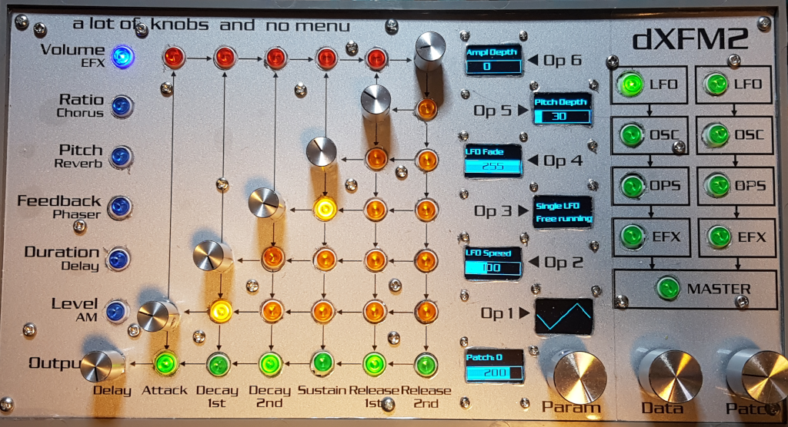
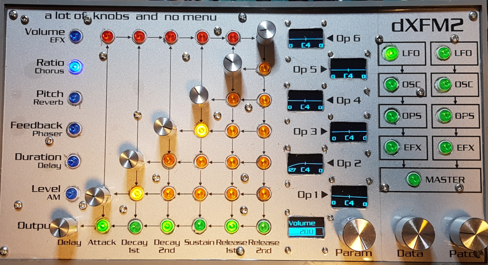
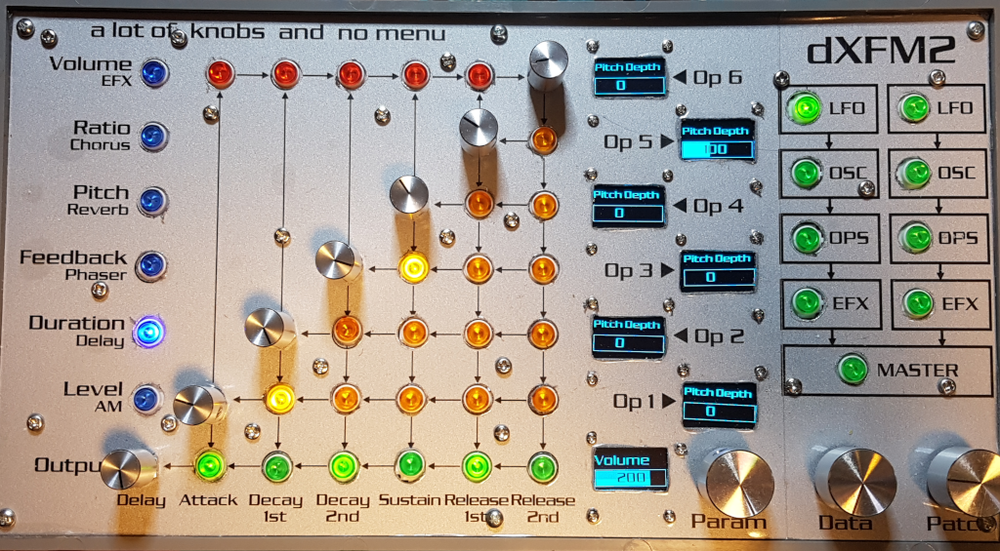
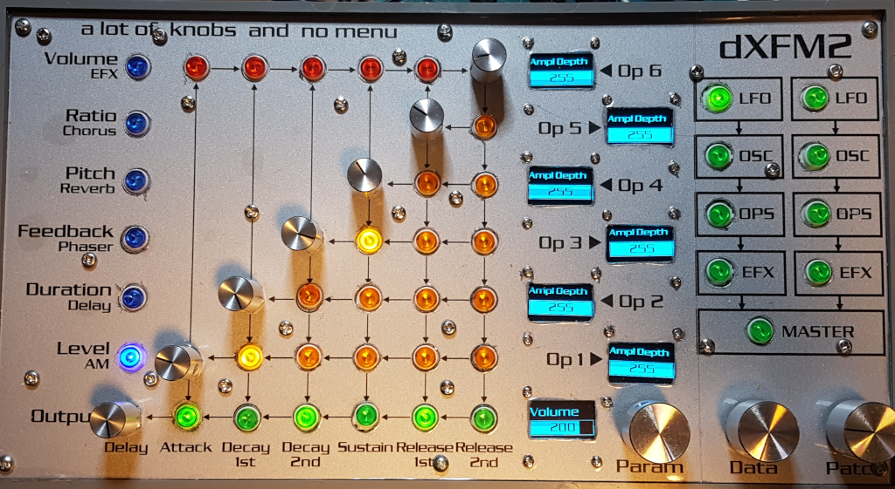

# LFO Low frequency oscillator menu

| Blue | 6 (Out) | 0 (Op1) | 1 (Op2) | 2 (Op3) | 3 (Op4) | 4 (Op5) | 5 (Op6) |
|------|---------|---------|---------|---------|---------|---------|---------|
| 0 | Volume | Wave | Speed | Sync | Fade | Pitch depth | Amp depth |
| 1 | Volume | L Depth/Curve | L Depth/Curve | L Depth/Curve | L Depth/Curve | L Depth/Curve | L Depth/Curve |
| 2 | Volume | Key BP | Key BP | Key BP | Key BP | Key BP | Key BP |
| 3 | Volume | R Depth/Curve | R Depth/Curve | R Depth/Curve | R Depth/Curve | R Depth/Curve | R Depth/Curve |
| 4 | Volume | PMS | PMS | PMS | PMS | PMS | PMS |
| 5 | Volume | AMS | AMS | AMS | AMS | AMS | AMS |

Parameter value mapping:

| Blue | 6 (Out) | 0 (Op1) | 1 (Op2) | 2 (Op3) | 3 (Op4) | 4 (Op5) | 5 (Op6) |
|------|---------|---------|---------|---------|---------|---------|---------|
| 0 | 180 | 153 | 151 | 152 | 154 | 149 | 150 |
| 1 | 180 | 51/63 | 52/64 | 53/65 | 54/66 | 55/67 | 56/68 |
| 2 | 180 | 45 | 46 | 47 | 48 | 49 | 50 |
| 3 | 180 | 57/69 | 58/70 | 59/71 | 60/72 | 61/73 | 62/74 |
| 4 | 180 | 222 | 223 | 224 | 225 | 226 | 227 |
| 5 | 180 | 159 | 160 | 161 | 162 | 163 | 164 |

## Volume (LFO main page)

## Ratio, Pitch & Feedback (Keyboard level scale)

- **Ratio** changes the left depth & curve
- **Pitch** changes the keyboard Breakpoint
- **Feedback** changes the right depth & curve

## Duration (LFO pitch sensitivity)

## Level (LFO amplitude sensitivity)

