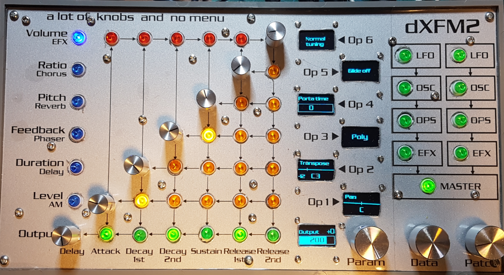
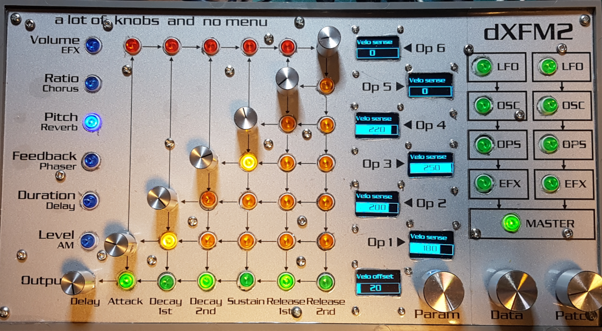
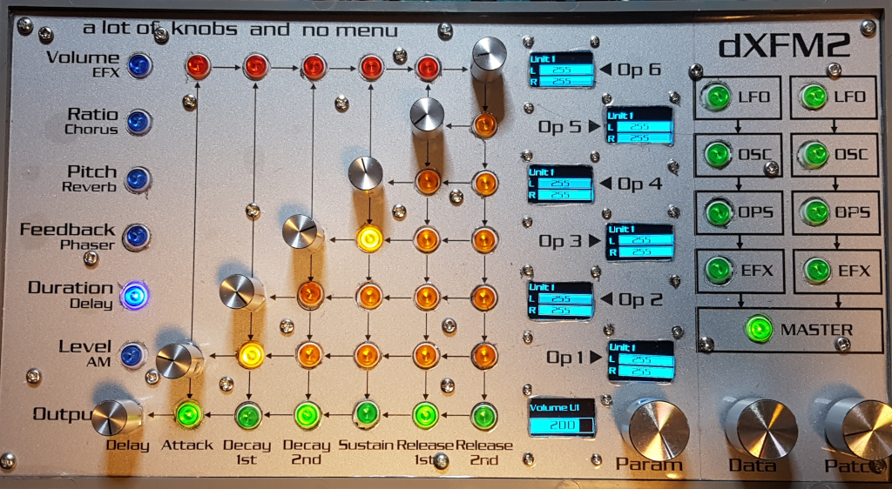

# Master menu

| Blue | 6 (Out) | 0 (Op1) | 1 (Op2) | 2 (Op3) | 3 (Op4) | 4 (Op5) | 5 (Op6) |
|------|---------|---------|---------|---------|---------|---------|---------|
| 0 | Output/Gain | Pan | Transpose | Mono-Poly | Porta time | Porta mode | Tuning |
| 1 |   |   |   |   |   |   |   |
| 2 | Velo offset U1 | Velo sense U1 | Velo sense U1 | Velo sense U1 | Velo sense U1 | Velo sense U1 | Velo sense U1 |
| 3 | Velo offset U2 | Velo sense U2 | Velo sense U2 | Velo sense U2 | Velo sense U2 | Velo sense U2 | Velo sense U2 |
| 4 | Vol U1 | Vol U1-L/R | Vol U1-L/R | Vol U1-L/R | Vol U1-L/R | Vol U1-L/R | Vol U1-L/R |
| 5 | Vol U2 | Vol U2-L/R | Vol U2-L/R | Vol U2-L/R | Vol U2-L/R | Vol U2-L/R | Vol U2-L/R |

Parameter value mapping:

| Blue | 6 (Out) | 0 (Op1) | 1 (Op2) | 2 (Op3) | 3 (Op4) | 4 (Op5) | 5 (Op6) |
|------|---------|---------|---------|---------|---------|---------|---------|
| 0 | 411/412 | 221 | 174 | 228 | 230 | 229 | 251 |
| 1 | 0 | 0 | 0 | 0 | 0 | 0 | 0 |
| 2 | 242 | 39 | 40 | 41 | 42 | 43 | 44 |
| 3 | 242 | 39 | 40 | 41 | 42 | 43 | 44 |
| 4 | 180 | 256/257 | 258/259 | 260/261 | 262/263 | 264/265 | 266/267 |
| 5 | 180 | 256/257 | 258/259 | 260/261 | 262/263 | 264/265 | 266/267 |

## Volume (master main page)

## Ratio

Reserved: this page is not yet assigned to any parameter

## Pitch & Feedback (velosity offset & sensitivity)

## Duration & Level (mixer for unit #1 & #2)

