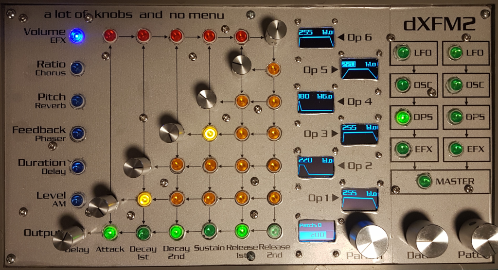
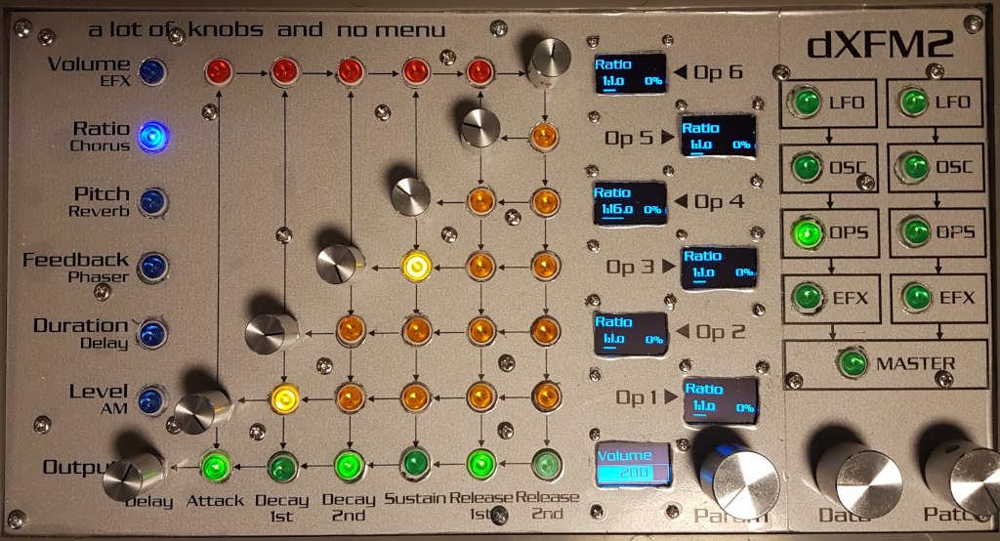
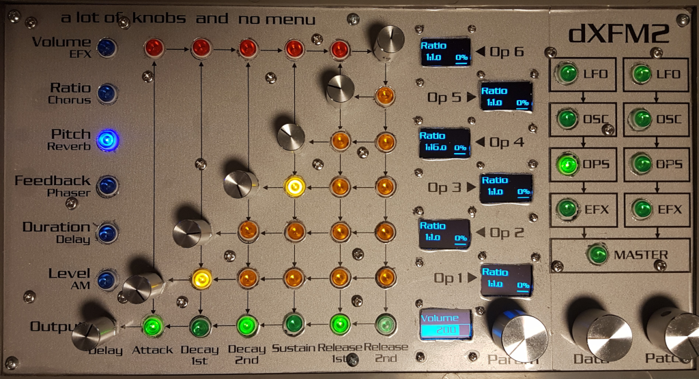
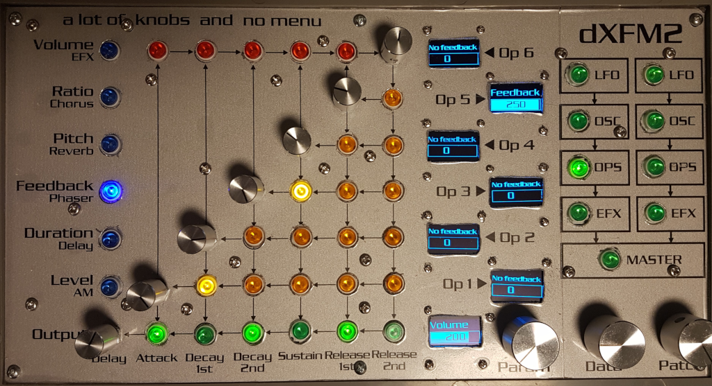
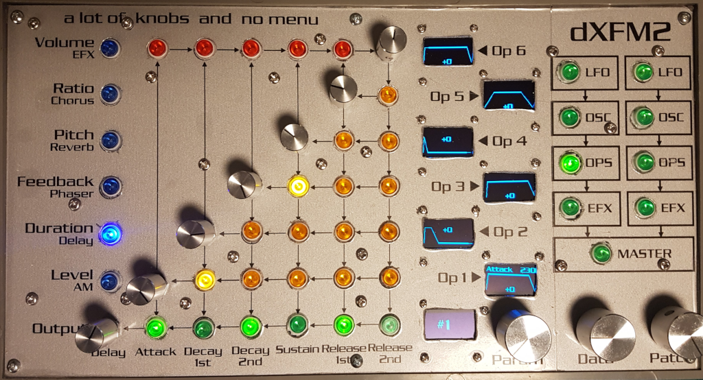

# OPS Operators menu

| Blue | 6 (Out) | 0 (Op1) | 1 (Op2) | 2 (Op3) | 3 (Op4) | 4 (Op5) | 5 (Op6) |
|------|---------|---------|---------|---------|---------|---------|---------|
| 0 | Volume | Level | Level | Level | Level | Level | Level |
| 1 | Volume | Ratio/R.Fine | Ratio/R.Fine | Ratio/R.Fine | Ratio/R.Fine | Ratio/R.Fine | Ratio/R.Fine |
| 2 | Volume | Fine (Mode) | Fine (Mode) | Fine (Mode) | Fine (Mode) | Fine (Mode) | Fine (Mode) |
| 3 | Volume | Feedback | Feedback | Feedback | Feedback | Feedback | Feedback |
| 4 | R0 (delay) | R1 (attack) | R2 (decay-1) | R3 (decay-2) | L2 & L3 (sustain) | R4 (release-1) | R5 (release-2) |
| 5 | L0 (delay) | L1 (attack) | L2 (decay-1) | L3 (decay-2) | L3 (sustain) | L4 (release-1) | L5 (release-2) |

The sustain dial in Blue-4 (duration mode) will change both L2 and L3 values.

Parameter value mapping:

| Blue | 6 (Out) | 0 (Op1) | 1 (Op2) | 2 (Op3) | 3 (Op4) | 4 (Op5) | 5 (Op6) |
|------|---------|---------|---------|---------|---------|---------|---------|
| 0 | 180 | 33 | 34 | 35 | 36 | 37 | 38 |
| 1 | 180 | 15/21 | 16/22 | 17/23 | 18/24 | 19/25 | 20/26 |
| 2 | 180 | 27 (14) | 28 (14) | 29 (14) | 30 (14) | 31 (14) | 32 (14) |
| 3 | 180 | 7 (1) | 8 (2) | 9 (3) | 10 (4) | 11 (5) | 12 (6) |
| 4 | 187+ | 103+ | 110+ | 117+ | 82+ & 89+ | 124+ | 199+ |
| 5 | 181+ | 75+ | 82+ | 89+ | 89+ | 96+ | 193+ |

## Volume

## Ratio

# Pitch

## Feedback

## Duration & Level (amplitude envelope)

In envelope mode, the dials do not correspond to a particular operator, but to a particular phase of the envelope:
- Output dial: delay phase (L0/R0);
- Operator 1 dial: attack phase (L1/R1);
- Operator 2 dial: decay-1 phase (L2/R2);
- Operator 3 dial: decay-2 phase (L3/R3);
- Operator 4 dial: sustain phase (L3);
- Operator 5 dial: release-1 phase (L4/R4);
- Operator 6 dial: release-2 phase (L5/R5).

You select the particular operator, by pressing the corresponding dial. This is made visible on the bottom screen.

In **Duration** mode, sustain acts as a "normal" ADSR sustain level, so not only L3 is affected, but also L2 (end of Decay-1 level). With settings L0=L4=L5=0 and L1=255, you get a "normal" ADSR. Attack sets the attack rate, decay-1 sets the decay rate and release-1 sets the release rate.

Two duration modes are available:
- ADDSRR: "normal" operation, rates for decay and release can be set independently.
- ADDS: "plucked" operation, rates for decay and release are matched. In this mode, you can quickly create plucked envelopes (the rate change of the sound after the attack phase matches the rate change of the sound after key release).

In **Level** mode, all dials correspond to the end level of that phase. Because the end level of decay-2 is the same as the end level of sustain, these dials respond to the same parameter, L3.

In level mode you can toggle between "regular" level mode and a mode in which you can change the rate key. In rate key mode, all operator dials correspond to their usual operator, as in a non-envelope mode.
