# FM Synthesis explained

## Sources

- https://www.futur3soundz.com/wavetable-synthesis
- https://en.wikipedia.org/wiki/Frequency_modulation_synthesis
- http://www.soundonsound.com/sos/apr00/articles/synthsecrets.htm
- https://www.soundonsound.com/techniques/more-frequency-modulation
- http://ccrma.stanford.edu/software/snd/snd/fm.html

## Theory

Let:
Fc: the frequency of the carrier
Fm: the frequency of the modulator
C: The frequency-ratio of the carrier (we will only use a value of C=1)
M: The frequency-ratio of the modulator
I: The modulation index

The "side band order" k=0,1,2,3,..

To compute the actual frequency spectrum, we need to consider the sidebands from the original carrier frequency Fc. The 0th order sideband is the frequency Fc. Sideband orders range from k=0,1,2,3,.. Both left sidebands (frequencies to the left of the carrier frequency) and right sidebands (frequencies to the right of the carrier frequency) occur. The actual frequencies of such a sideband is related to the modulation frequency: Fc ± k*Fm

You only need to calculate the I+2 order sideband, all other sidebands will have negligible amplitudes.

The amplitude of a particular order sideband k is calculated using the Bessel function of the same order k of the modulation index:

Amplitude = BesselJ(k,I)

A sideband corresponds to a frequency, so we get the amplitude for that frequency. But we have some things to consider:
- Sideband at frequency 0 is actually a DC offset, so if such a sideband would occur we can ignore this sideband. This frequency only occurs for M = C / r, with r = 1,2,3,... For M>=C this only occurs at M = C.
- Bessel functions with order above 3 can have negative results, so the calculated amplitude is actually negative.
- Odd sidebands at negative frequency have a phase shift of 180 degrees, so as these sidebands are sinoid curves, this phase shift can also be represented by switching the amplitude sign, mainting the same phase as all other sidebands: negative amplitudes become positive, positive amplitudes become negative.
- Sidebands at negative frequencies are actually sidebands at the same positive frequency, but with another phase shift of 180 degrees: another sign switch.

[This excel spreadsheet](fmsynthesis.xlsx) calculates the correct sideband frequencies and amplitudes for a give carrier frequency, modulation ratio and modulation index (for modulation ratio >= 1).

For better understanding of the frequency of the sideband, it is more intuitive to depict them as a ratio of the carrier frequency: R1=Fc, the carrier frequency, R2 = 2*Fc, etc.

| M | Frequencies | First 8 frequency ratios |
|---|-------------|------------------|
| 1 | Fc(1 ± k) | 1,2,3,4,5,6,7,8 |
| 2 | Fc(1 ± 2k) | 1,3,5,7,9,11,13 |
| 3 | Fc(1 ± 3k) | 1,2,4,5,7,8,10,11 |
| 4 | Fc(1 ± 4k) | 1,3,5,7,9,11,13 |
| 5 | Fc(1 ± 5k) | 1,4,6,9,11,14,16,19 |
| 6 | Fc(1 ± 6k) | 1,5,7,11,13,17,19,23 |
| 7 | Fc(1 ± 7k) | 1,6,8,13,15,20,22,27 |
| 8 | Fc(1 ± 8k) | 1,7,9,15,17,23,25,31 |

Observe that we have already "mirrored" the negative frequencies to positive frequencies, resulting in extra frequency ratios if M is odd and larger than 1.

Some observations:
- Only M=1 will give us all harmonic frequency components
- When M has an even value, only odd harmonic frequency components are available
- M=2 and M=4 have the same possible frequency components (all odd ratio's)
- Higher values of M (from M=4) won't have frequency components between 2 and M-1

### Some observations how M and I change the timbre of the sound

- I = 0 disables the modulation completely (as expected), so M doesn't matter;
- The larger I, the more sidebands have relevant amplitudes
- M = 1 will have all harmonic frequency components (1,2,3,..)
- The larger M, the greater the gap between frequency components (for example: M=2 will only have odd harmonic frequency components: 1,3,5,7)
- The larger M, the higher the frequency with the last relevant amplitude.

This means that we have two ways of obtaining a "higher" tembre:
- Increasing I (more sidebands, so the last relevant one will have a higher frequency);
- Increasing M (larger gap between sideband frequencies, so the last relevant one will have a higher frequency).

## Examples

### Sawtooth-like (M=1, I=1,3)
Fc = 440, Fm = 440, C = 1, M = 1, I = 1,3

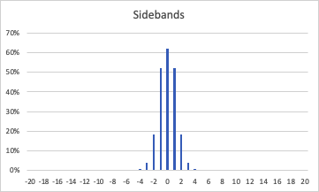

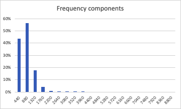

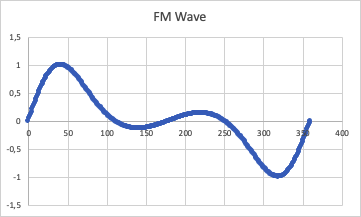

### Square-like (M=2, I=1,3)
Fc = 440, Fm = 440, C = 1, M = 1, I = 1,3

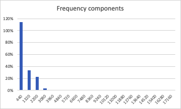

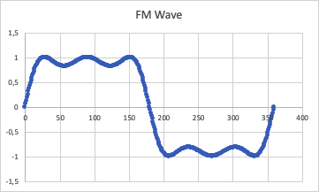

### M=1, I=0 (no modulation)
Fc = 440, Fm = 440, C = 1, M = 1, I = 0

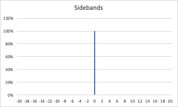

No sidebands, because I=0

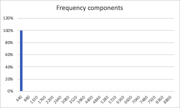

Because I=0, the modulation ratio doesn't matter: only one frequency component at R1 with amplitude 100%.

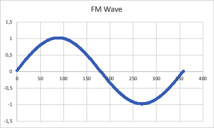

### M=1, I=1
Fc = 440, Fm = 440, C = 1, M = 1, I = 1

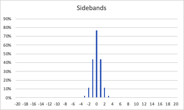

Sidebands at 0, ±1, ±2, ±3, ...

Frequency components with amplitude larger than 10% at R1, R2 and R3 (440,880,1320)

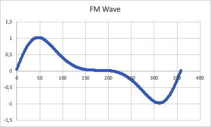

### M=1, I=2

Fc = 440, Fm = 440, C = 1, M = 1, I = 2

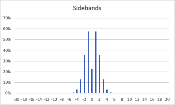

Sidebands at 0, ±1, ±2, ±3, ...

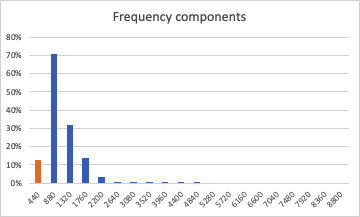

Frequency components with amplitude larger than 10% at R1, R2, R3, R4 (440,880,1320,1760). The frequency component at R1 is depicted in orange: it has a negative amplitude (phase shifted 180 degrees).

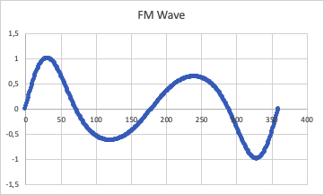

### M=1, I=5

Fc = 440, Fm = 440, C = 1, M = 1, I = 5

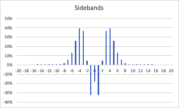

Sidebands at 0, ±1, ±2, ±3, ...

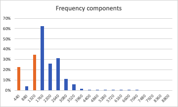

Frequency components with amplitude larger than 10% at R1, R3, R4, R5, R6, R7 (440,1320,1760,2200,2640,3080)

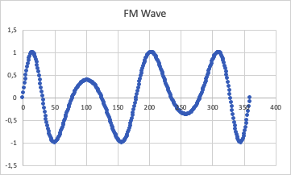

### M=2, I=1
Fc = 440, Fm = 880, C = 1, M = 2, I = 1

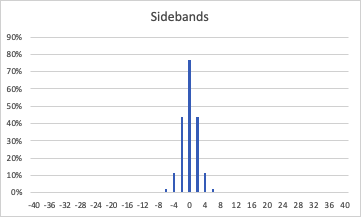

Sidebands at 0, ±2, ±4, ±6, ...

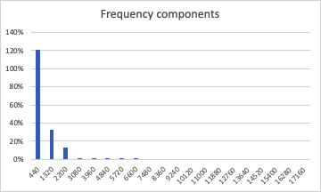

Frequency components with amplitude larger than 10% at R1, R3 (440,1320)

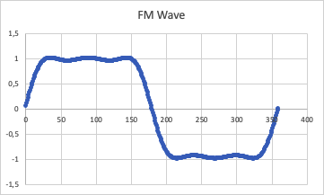

### M=2, I=2
Fc = 440, Fm = 880, C = 1, M = 2, I = 2

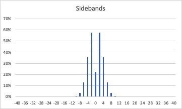

Sidebands at 0, ±2, ±4, ±6, ...

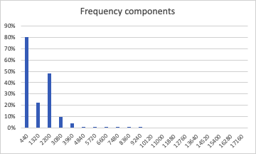

Frequency components with amplitude larger than 10% at R1, R3, R5, R7 (440,1320,2200,3080)

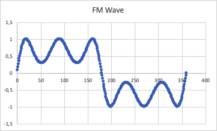

### M=2, I=5
Fc = 440, Fm = 880, C = 1, M = 2, I = 5

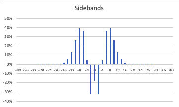

Sidebands at 0, ±2, ±4, ±6, ...

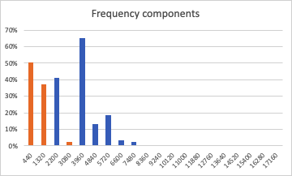

Frequency components with amplitude larger than 10% at R1, R3, R5, R9,R11,R13 (440,1320,2200,3960,4840,5720)

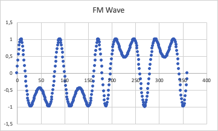

### M=3, I=1
Fc = 440, Fm = 1320, C = 1, M = 3, I = 1

Sidebands at 0, ±3, ±6, ±9, ...

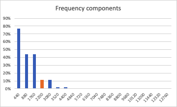

Frequency components with amplitude larger than 10% at R1,R2,R3,R4,R5 (440,880,1760,2200,3080)

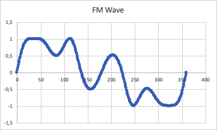

### M=3, I=2
Fc = 440, Fm = 1320, C = 1, M = 3, I = 2

Sidebands at 0, ±3, ±6, ±9, ...

Frequency components with amplitude larger than 10% at R1, R2, R4 (440,880,1760,2200,3080,4400)

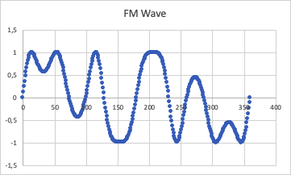

### M=3, I=5
Fc = 440, Fm = 1320, C = 1, M = 3, I = 5

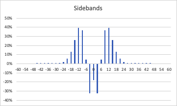

Sidebands at 0, ±3, ±6, ±9, ...

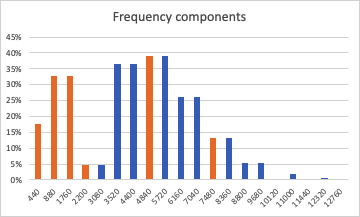

Frequency components with amplitude larger than 10% at R1, R2, R4, R5, R7 (440, 880, 1760, 2200, 3080)

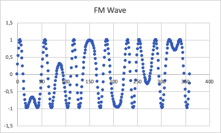
