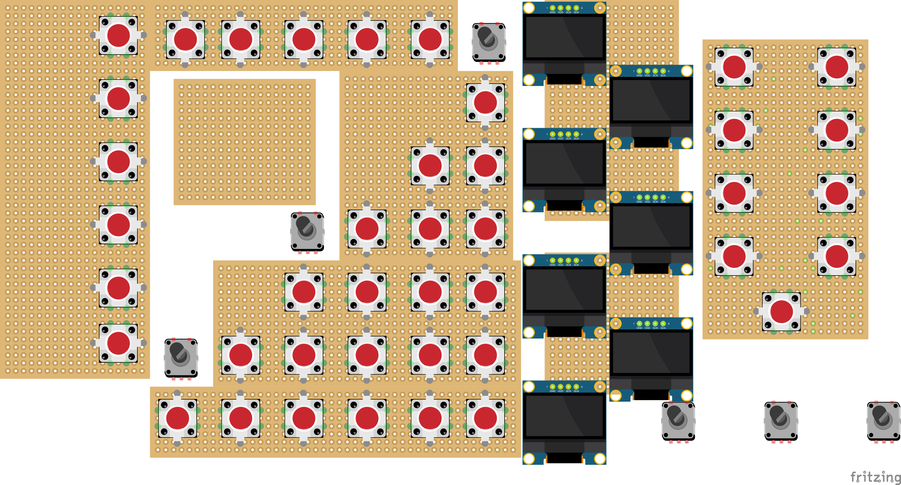

# Front panel

The front panel is made up of the following elements:

- Panels #1 to #6, fitting tightly together. Will probably fit them using screws, need to find out...
- A panel containing the MCP23017s, fitted to the front panel via two screws
- The OLED screens and PCBs, fitted to the front panel via four screws for every OLED screens. The PCBs are attached to the OLED screens via the headers, so no screws needed.
- The 10 rotary encoders, using the nuts and screw wire of the encoder itself.

Not all encoders are displayed: some are obscured by the PCB's (which need to be cut into shape!)

