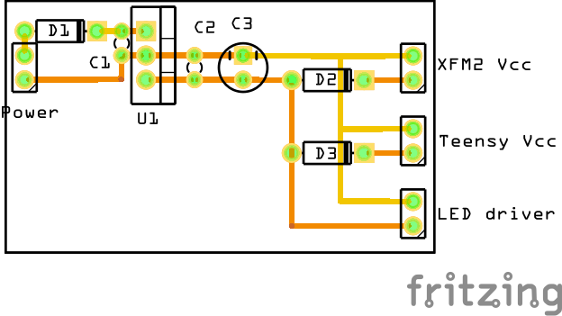

# Power source

Power comes from a 9V wall transformer. Anything between 8V and 12V is probably OK (see 7805 datasheet).

See the diagram below for the actual circuit.

## Components explained

### Regulator
* A normal 7805 5V regulator is used.

### Diodes
* A rectifier diode is used before the voltage regulator to protect the circuit from reverse polarity. The voltage drop is about 0.7V, so the actual voltage going into the voltage regulator is Vin - 0.7V. So we are pretty flexibel with the input voltage, as long as it is 0.7V above the minimum specified in the 7805 datasheet.
* A skotty diode is used between the ouputs to the XFM2 and the Teensy. These diodes are necessary, because we want to power the XFM2 and the Teensy from USB, and we don't want any voltage going into the rest of the circuit (or back into the voltage regulator). The diode will drop the voltage from the regulator a bit. We probably get around 4.7V into the XFM2 and the Teensy. This is according to specifications (and actually this is the specified way to have both XFM2 and Teensy dual powered!).

### Capacitors
* A 470uF capacitor is used as a low frequency filter of the output of the voltage regulator and (maybe more important) a powerbuffer when a lot of current is drawn from the regulator. Probably overkill, but we don't want the CPU's to go down because we light up the christmas tree of LED's :-).
* A 100nF capacitor high frequency filter for the output of the regulator and a 220nF capacitor high frequency filter for the input of the regulator are used according to spec (actually a 330nF is specified, but that we don't have...). This makes the output of the regulator a bit more stable.

## breadboard
Bottom of the breadboard is the input voltage (9V, or whatever), Top of the breadboard is the output voltage (5V)

## PCB
The input for the power regulator comes from a socket mounted into the enclosure. So we have two pads on the PCB marked Vin and GND.

The output to the other circuits is via 2 male sockets. Every circuit (XFM2, Teensy, LED driver) has its own 2 pins: Vcc and GND. The LED driver gets 5V, the XFM2 and Teensy 5V minus the drop of the skotty diode (about 4.8V).

