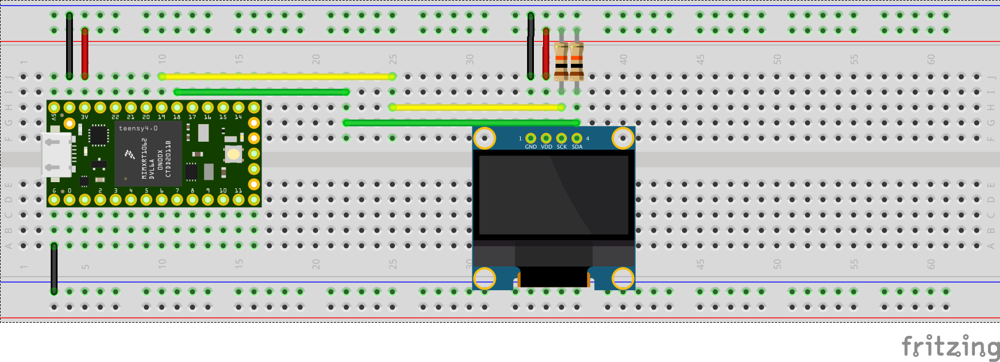

# Teensy-OLED

## Elektronica

Het schema voor de Teensy kun je [hier](teensy40.md) vinden.

Daaruit blijkt de volgende opbouw:
- Pin 1 is Ground (gelabeld "G")
- Pin 25 is SDA-0 (gelabeld "18")
- Pin 26 is SCL-0 (gelabeld "19")
- Pin 31 is 3.3V (gelabeld "3V")

Daarmee is ook duidelijk hoe we ze moeten verbinden:
- Ground met GND op de OLED
- SDA-0 met SDA op de OLED
- SCL-0 met SCK op de OLED
- 3.3V met VDD op de OLED

Merk op dat op een Arduino dit vrij vergelijkbaar is:
- Arduino GND met GND op de OLED
- Arduino A4 met SDA op de OLED (A4 is ook pin 25 op de Teensy)
- Arduino A5 met SCK op de OLED (a5 is ook pin 26 op de Teensy)
- Arduino 5V met VDD op de OLED

Merk op dat daarmee de OLED op 5V draait met de Arduino, en op 3.3V op de Teensy.

Tenslotte is het van belang om twee 10K pull-up resistors te verbinden met SDA en SCK. Pull-up resistors zijn noodzakelijk bij een I2C bus. Dergelijke pull-up resistors kunnen al op een bordje zitten waarop het OLED scherm zit, maar dit is niet altijd het geval. Onduidelijk is ook of dit voor dit schermpje zo is, maar het lijkt van niet: dus deze ook afzonderlijk toevoegen.

Zie ook: https://electronics.stackexchange.com/questions/102611/what-happens-if-i-omit-the-pullup-resistors-on-i2c-lines
Hoewel de wire library de interne pull-ups van de Arduino/Teensy activeert, zijn deze te groot (50K?). Dus dan werken 10K beter. Of wellicht 4.7K nog iets beter. Uiteindelijk is het een verhouding tussen R en C, waarbij C toeneemt als je meer draadjes of elementen toevoegd aan de I2C bus. En aangezien we nogal wat OLEDs willen toevoegen, is de kans groot dat we de pull-ups nog wat lager willen doen.

Het resultaat ziet er dan op een breadboard als volgt uit:

## Op zoek naar de I2C client
Een I2C client werkt op een bepaald adres. Zonder dit adres te weten, zal de client niet weten wat hij moet doen, en zal dus het OLED schermpje niets laten zien.

Op https://playground.arduino.cc/Main/I2cScanner/ is een I2C scanner te vinden, die zal vertellen op welk adres de OLED display zit. In ons geval is dit 0x3C.

## Adafruit SSD1306 library
De pagina op tinytronics toont aan dat de OLED display werkt met de u2g2 library. Deze werkt "from ground up", en biedt bovendien een softwarematige I2C library (die vrij traag is). Het is echter wel een handige om problemen te vinden. De library werkt zowel voor de Arduino Uno als de Teensy 4.0, mits bij die laatste de SDA-0/SCL-0 pins worden gebruikt (de Teensy 4.0 heeft meerdere I2C bussen).

We willen echter de SSD1306 library gebruiken: deze werkt voor onze display, maar heeft als voordeel dat deze de Wire library gebruikt, die weer van belang is als we straks de I2C multiplexer gaan gebruiken. Beter nu dan alvast de goede library gebruiken!

Het voorbeeld dat bij deze library staat werkt voor deze display (gebruik het 128x64 I2C voorbeeld), maar in plaats van 3D moet 3C gekozen worden voor het I2C-adres van de display.

Het plan is dus nu om voor 1 OLED display een mooie user interface te maken!
